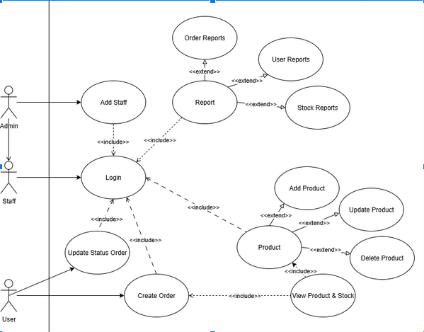
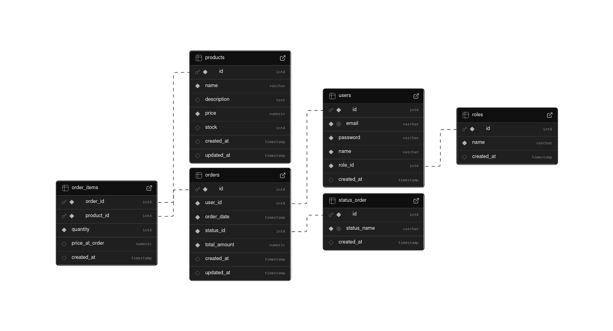

# CLI Project - Clothing E-Commerce

## Deskripsi
Proyek ini merupakan aplikasi **Command Line Interface (CLI)** untuk sistem manajemen **E-Commerce Pakaian**.  
Dibangun menggunakan bahasa **Go (Golang)** dengan dukungan **PostgreSQL** dan berbagai library pendukung.  
Aplikasi ini memungkinkan **Admin**, **Staff**, dan **User** melakukan operasi seperti login, manajemen produk, pemrosesan pesanan, serta pembuatan laporan (report).

---

## Fitur Utama

### Admin
- Login ke sistem.
- Menambahkan data Staff baru.
- Mengakses fitur manajemen dan laporan.

### Staff
- Login ke sistem.
- Melihat daftar produk & stok.
- Menambahkan, memperbarui, dan menghapus produk.
- Mengupdate status pesanan.
- Mengakses laporan:
  - Laporan User
  - Laporan Stok
  - Laporan Pesanan

### User
- Login ke sistem.
- Melihat daftar produk.
- Membuat pesanan.
- Melihat dan memperbarui status pesanan.

---

## Use Case Diagram

**Aktor:** Admin, Staff, User  
**Use case utama:**
1. Login  
2. Add Staff  
3. Product Management (Add, Update, Delete)  
4. Create Order  
5. Update Status Order  
6. Reports (User, Order, Stock)

---

## Skenario Use Case (Ringkasan)

### 1. Login
1. Aktor membuka halaman login.  
2. Sistem menampilkan form login.  
3. Aktor mengisi email & password.  
4. Sistem memvalidasi dan mengarahkan sesuai role.

### 2. Add Staff
1. Admin login.  
2. Membuka menu tambah staff.  
3. Mengisi data staff.  
4. Sistem menyimpan data ke database.

### 3. Product Management
1. Aktor membuka menu produk.  
2. Melihat daftar produk & stok.  
3. Melakukan aksi tambah, ubah, atau hapus produk.  
4. Sistem menyimpan perubahan.

### 4. Create Order
1. User login dan melihat daftar produk.  
2. Memilih produk & jumlah.  
3. Sistem menghitung total & menyimpan pesanan.

### 5. Update Order Status
1. Staff membuka menu pesanan.  
2. Mengubah status pesanan.  
3. Sistem memperbarui status di database.

### 6. Reports
1. Aktor membuka menu laporan.  
2. Memilih jenis laporan (User / Order / Stock).  
3. Sistem menampilkan laporan sesuai pilihan.

---

## Entity Relationship Diagram (ERD)

---

## Prototype CLI

Aplikasi dijalankan melalui terminal menggunakan Cobra CLI dan PromptUI untuk navigasi menu dan input pengguna.

---

## Tim Pengembang
- Rafly Ade Kusuma
- Deden Ruslan
- Aisiya Qutwatunnada
